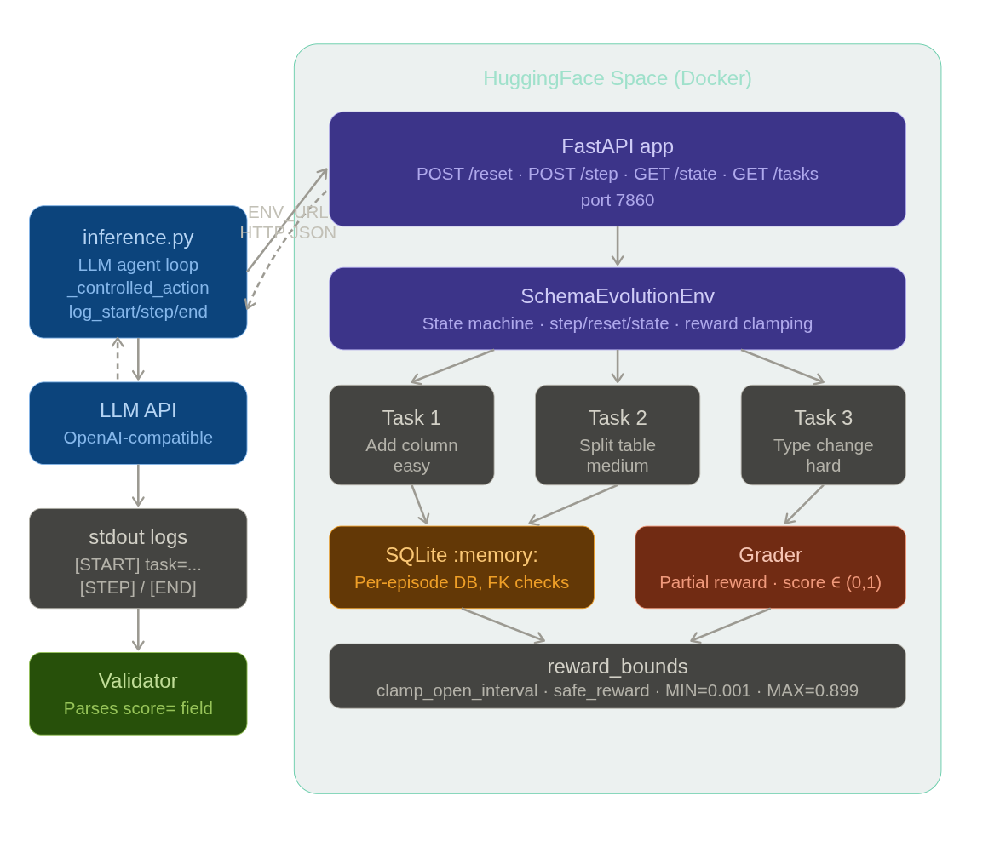

# Schema Evolution Environment

An [OpenEnv](https://openenv.dev)-compatible reinforcement learning benchmark that evaluates agents on real-world database migration tasks. Agents inspect a live SQLite database, plan a migration strategy, execute SQL, validate constraints, and submit a final result — all through a structured action/observation API.

---

## Overview

Database schema migrations are a high-stakes, real-world engineering task that require careful planning, execution, and validation. This environment simulates three progressively harder migration challenges, rewarding agents for partial progress and penalising destructive or incorrect changes.

The environment runs as a FastAPI server on HuggingFace Spaces. An agent interacts with it through HTTP calls, receiving schema observations and reward signals at each step.

---

## Architecture



The baseline agent in `inference.py` talks to the Space over HTTP (`POST /reset`, `POST /step`, `GET /state`). `SchemaEvolutionEnv` applies migrations on in-memory SQLite; the grader scores partial progress with rewards clamped strictly inside `(0, 1)`. Structured `[START]` / `[STEP]` / `[END]` logs go to stdout for automated evaluation.

---

## Tasks

### Task 1 — Add column (easy)

Add `users.is_verified BOOLEAN NOT NULL DEFAULT 0` to a users table with 100 existing rows. The grader checks column existence, type, default value, NOT NULL constraint, and row count preservation.

**Reward breakdown:**
- Column exists with correct type → 0.40
- Default value is 0 → 0.30
- Row count unchanged → 0.20
- NOT NULL constraint present → 0.10

### Task 2 — Split table (medium)

Normalise repeated customer data embedded in an `orders` table into a new `customers` table. The agent must create the customers table, deduplicate rows, add `orders.customer_id`, populate foreign keys, and preserve referential integrity.

**Reward breakdown:**
- Customers schema correct → 0.25
- Customers deduplicated → 0.20
- `orders.customer_id` column added → 0.25
- All orders linked correctly → 0.20
- No foreign key violations → 0.10

### Task 3 — Type change (hard)

Migrate `transactions.amount` from formatted TEXT (e.g. `$1,234.56`) to REAL without breaking a dependent `summary_views` view or the `audit_log` table. The agent must handle currency symbols, comma separators, and whitespace, then verify the numeric sum matches the expected total.

**Reward breakdown:**
- Column type is REAL or NUMERIC → 0.20
- All rows numeric → 0.25
- Sum matches expected total (±0.01) → 0.20
- `summary_views` view intact → 0.20
- `audit_log` row count unchanged → 0.15

---

## Action space

All actions are JSON objects sent via `POST /step`.

| Action | Parameters | Description |
|--------|-----------|-------------|
| `inspect_schema` | `table: str` ("all" or table name) | Returns current schema as JSON |
| `sample_data` | `table: str`, `limit: int` | Returns up to 20 rows as a markdown table |
| `run_migration` | `sql: str` | Executes SQL via `executescript` |
| `validate_constraints` | — | Runs `PRAGMA integrity_check` and `foreign_key_check` |
| `rollback` | — | Resets DB to initial state from setup SQL |
| `submit_final` | — | Triggers grader, ends episode |

---

## Observation space

Each `POST /step` response contains:

```json
{
  "observation": {
    "task_id": "task1_add_column",
    "step": 3,
    "schema": { "tables": { ... } },
    "last_action_result": "Migration applied successfully.",
    "cumulative_reward": 0.05,
    "done": false,
    "goal": "Add users.is_verified BOOLEAN NOT NULL DEFAULT 0 ..."
  },
  "reward": 0.05,
  "done": false,
  "info": {}
}
```

---

## Reward design

- `inspect_schema` and `sample_data` return `reward=0.0` (observation only)
- `run_migration` returns `reward=0.05` on success, `0.0` on failure
- `validate_constraints` returns `reward=0.05` on pass, `0.0` on fail
- `rollback` returns `reward=0.0`
- `submit_final` triggers the grader and returns a partial-credit score

All rewards are clamped to the open interval `(0, 1)` — never exactly `0.0` or `1.0`. Max episode length is 20 steps.

---

## Setup and running

### Requirements

- Python 3.11+
- Docker

### Environment variables

| Variable | Description |
|----------|-------------|
| `API_BASE_URL` | Base URL for the OpenAI-compatible LLM API |
| `MODEL_NAME` | Model identifier (e.g. `gpt-4o`) |
| `HF_TOKEN` | HuggingFace / API key |
| `ENV_URL` | URL of the running environment (default: `http://127.0.0.1:7860`) |

### Running locally

```bash
# Install dependencies
pip install -r requirements.txt

# Start the environment server
uvicorn app.main:app --host 0.0.0.0 --port 7860

# In another terminal, run inference
export API_BASE_URL=https://your-api-url
export MODEL_NAME=your-model
export HF_TOKEN=your-token

python inference.py
```

### Running with Docker

```bash
docker build -t schema-evolution-env .
docker run -p 7860:7860 schema-evolution-env
```

### HuggingFace Space

The environment is deployed at: `https://huggingface.co/spaces/gunther876/openenv-schema-evolution-env`

---

## Project structure

```
.
├── inference.py              # Baseline agent script (OpenEnv spec compliant)
├── Dockerfile
├── requirements.txt
├── openenv.yaml
└── app/
    ├── main.py               # FastAPI routes
    ├── environment.py        # SchemaEvolutionEnv state machine
    ├── models.py             # Pydantic typed models
    ├── reward_bounds.py      # Reward clamping utilities
    ├── graders/
    │   └── grader.py         # Per-task grading logic
    └── tasks/
        ├── __init__.py       # TASKS registry
        ├── task1_add_column.py
        ├── task2_split_table.py
        └── task3_type_change.py
```

---

## Log format

The inference script emits structured stdout logs consumed by the OpenEnv validator:

```
[START] task=task1_add_column env=schema-evolution-env model=gpt-4o
[STEP] step=1 action=inspect_schema reward=0.000000 done=false error=None
[STEP] step=2 action=run_migration reward=0.050000 done=false error=None
[STEP] step=3 action=validate_constraints reward=0.050000 done=false error=None
[STEP] step=4 action=submit_final reward=0.850000 done=true error=None
[END] success=true steps=4 score=0.950000 rewards=[0.0, 0.05, 0.05, 0.85]
```

---

## Baseline results

The included `inference.py` uses a hybrid strategy: an LLM agent with hardcoded recovery fallbacks that trigger when the agent stalls. Typical scores:

| Task | Difficulty | Typical score |
|------|-----------|---------------|
| task1_add_column | easy | 0.85–0.95 |
| task2_split_table | medium | 0.55–0.75 |
| task3_type_change | hard | 0.40–0.65 |

---

## Links

- HuggingFace Space: https://huggingface.co/spaces/gunther876/openenv-schema-evolution-env
- GitHub: https://github.com/GeekyRiolu/openenv-schema-evolution-env